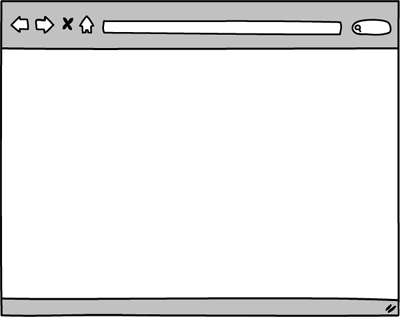
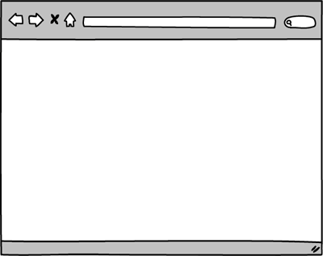
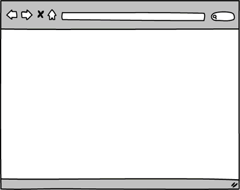
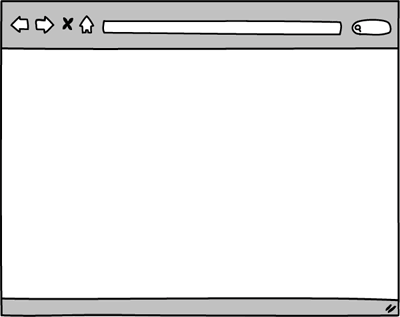

# Экзамен: создание CRUD приложения 

## Введение
#### Цель данного экзамена:

Проверить ваши знания по backend-разработке. А именно знания следующих технологий: Express, AJAX(fetch/axios), PostgreSQL, Sequelize, аутентификация и авторизация с использованием сессий/токенов, следование принципам RESTful API.

Вам предстоит создать сайт для организации вечеринок (в формате [potluck dinners][]). Пользователи смогут устраивать вечеринки у себя, и присоединяться к другим вечеринкам. Вы будете разрабатывать сайт последовательно, элемент за элементом. Требования к каждому такому элементу описаны в разделе Releases.

---

## Releases

*Пожалуйста, не исполняйте команду `git push` до окончания экзамена*

### Pre-release: Setup
Убедитесь, что в вашем проекте установленные все необходимые вам библиотеки, создайте базу данных.

### Release 0: User Registration
Первое, что нужно сделать - это регистрация пользователей. Не забудьте про шифрование паролей, называйте ваши routings по стандартам REST API, CRUD. [REST API Best Practices
](https://habr.com/post/351890/)

Добавьте ссылку на регистрацию на домашнюю страницу. Реализуйте регистрацию. email/username у пользователей должны быть уникальны. Если регистрация не успешная - пользователь должен быть оповещен об этом. Если она прошла успешно - пользователь входит в систему и перенаправляет на домашнюю страницу. Ссылка на регистрацию заменяется именем пользователя. Примерно как на Рисунке 1:

  
*Рисунок 1*. Успешная и неспешная регистрация.

### Release 1: Login/Logout

Добавьте "login" и "logout". 
На домашней странице добавьте ссылку на "login" следом за ссылкой на регистрацию. По нажатии на ссылку - пользователя должно перенаправлять на форму авторизации. Пользователи авторизуются при помощи e-mail и пароля.

Не забудьте обрабатывать ошибки: если у пользователя не получается залогиниться - ему хотелось бы знать причину. При успешном входе - вместо кнопки "login" должна появляться "logout". При нажатии на logout пользователь выходит из системы и оказывается на домашней странице приложения.

  
*Рисунок 2*. Успешная и неуспешная аутентификация, выход.

### Release 2: Устроить вечеринку!
Добавьте зарегистрированным пользователям возможность устраивать вечеринки. Залогиненные пользователи должны видеть ссылку "устроить вечеринку" на домашней странице. Ссылка должна перенаправлять пользователя на форму. На форме пользователь вводит дату, время, место.

Когда пользователь нажимает на кнопку отправки формы, то в случае ошибки (валидация?), пользователь должен видеть свою форму и текст ошибки. Если же все прошло успешно - пользователя перенаправляет на страницу созданной им вечеринки, на которой отображаются все подробности. Все вечеринки должны быть связанны с пользователями, создавшими их. См. Рисунок 3.

*Примечание:*  Дата и время - не текстовые поля. Посмотрите, какой тип данных лучше подходит для сбора и хранения этих данных.

  
*Рисунок 3*.  Успешное и неуспешное добавление вечеринки.

### Release 3:  Просмотр вечеринок.
Добавьте возможность просмотра списка вечеринок. Пусть они отображаются на домашней странице для всех пользователей. Отображать надо только те вечеринки, которые еще не начались (Либо не закончились). Они должны быть отсортированы по времени начала. Самые ближайшие вечеринки (или например те, что идут прямо сейчас) должны быть в самом начале списка. Для каждой вечеринки необходимо отображать название, место, время начала. Имя должно быть ссылкой. По нажатии на нее пользователь переходит на страницу с подробной информацией о соответствующей вечеринке. См. Рисунок 4.

  
*Рисунок 4*.  Просмотр списка вечеринок, просмотр детальной информации о каждой.

### Release 4: Редактирование информации о вечеринке.
Позвольте пользователям вносить изменения в свои вечеринки. Если пользователь авторизован и является автором вечеринке, то на странице этой вечеринки должна быть ссылка "Редактировать". Нажимаем на нее - попадаем на форму редактирования. Форма уже должна содержать текущие данные о вечеринке. Отправка формы должна обновить данные о вечеринке и перенаправить пользователя на страницу вечеринки. В случае ошибки - пользователь остается на форме и видит текст ошибки.
См. Рисунок 5.

  
*Рисунок 5.* Авторизация и успешное редактирование вечеринки.

### Release 5: Отмена вечеринки
Не всегда все идет по плану, мама может передумать и не оставить вас одних дома - в итоге вечеринку придется отменить. Добавим и эту деталь к нашему приложению. Добавьте ссылку "Отменить" на странице вечеринки. Отменять может только тот, кто является инициатором вечеринки. При отмене вечеринка должна удаляться из БД. В случае успешной отмены - вас перенаправит на домашнюю страницу. См. Рисунок 6.
*Примечание:*  Ссылка на отмену на самом деле не совсем ссылка. Скорее всего это кнопка, возможно часть формы, либо какой-то элемент, по нажатии на который отправляется запрос с методом DELETE (тот метод, что есть в CRUD).

  
*Рисунок 6*.  Авторизация и удаление вечеринки.

### Release 6: Неужели все уже работает так как надо?
Давайте убедимся, что наше приложение в порядке. Для этого попробуйте ответить на вопросы:

- У кого есть доступ к форме на добавление вечеринки?
- Кто может редактировать вечеринку? Только ли ее инициатор?
- Кто может удалить вечеринку?

Считаете, что ваше приложение работает так как и должно работать? Тогда идем дальше.

### Release 7: Хочу пойти на эту вечеринку!
Чуть не забыли зачем, затеяли разработку этого приложения. Нам ведь нужно иметь возможность пойти на вечеринку, а не только устраивать их. Пойти могут только авторизованные пользователи.

Измените страницу вечеринки, теперь надо отображать всех тех, кто планирует быть на ней. Также надо отображать какие еду/напитки они принесут. Если пользователь не является автором вечеринки - у него должна быть возможность присоединиться к ней. Добавьте ссылку "Хочу пойти!", которая перенаправит пользователя на форму. В ней он укажет, что он возьмет с собой. Надо учитывать, что несколько людей не могут приносить на вечеринку одно и то же.

В случае ошибки - пользователь видит сообщение, с указанием в чем проблема. Если все прошло успешно - пользователя перенаправит на страницу вечеринки. Но теперь на этой странице пользователь не будет видеть ссылку "Хочу пойти!", вместо этого он будет видеть что-то вроде "Не забудь принести ${фрукты}". То есть тот продукт, что он указал при регистрации на вечеринку. См. Рисунок 7.

  
*Рисунок 7*.  Авторизация и заявка на участие в вечеринке.

## Заключение

Вы можете делать столько коммитов, сколько вам необходимо. Однако, пожалуйста, не исполняйте команду `git push` до окончания экзамена. Не искушайте ваших одногруппников подсматривать ваш код.

[potluck dinners]: https://en.wikipedia.org/wiki/Potluck
